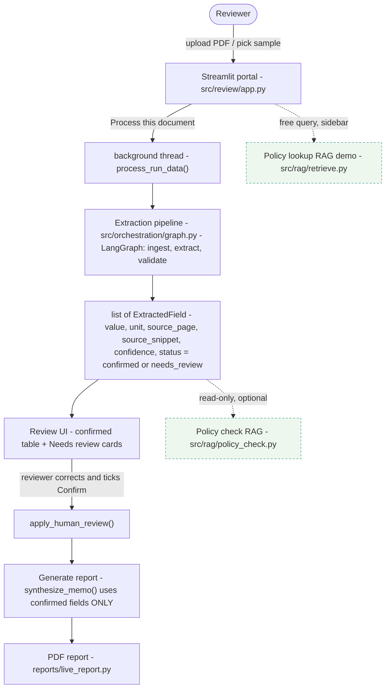
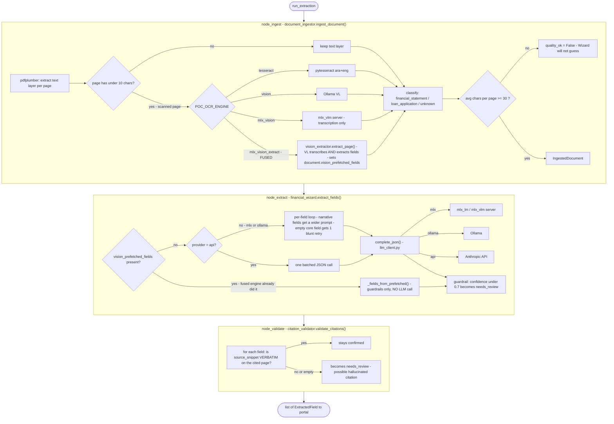
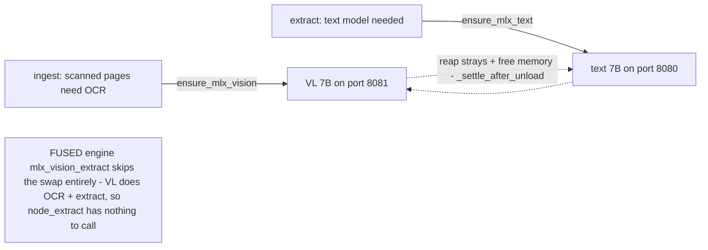
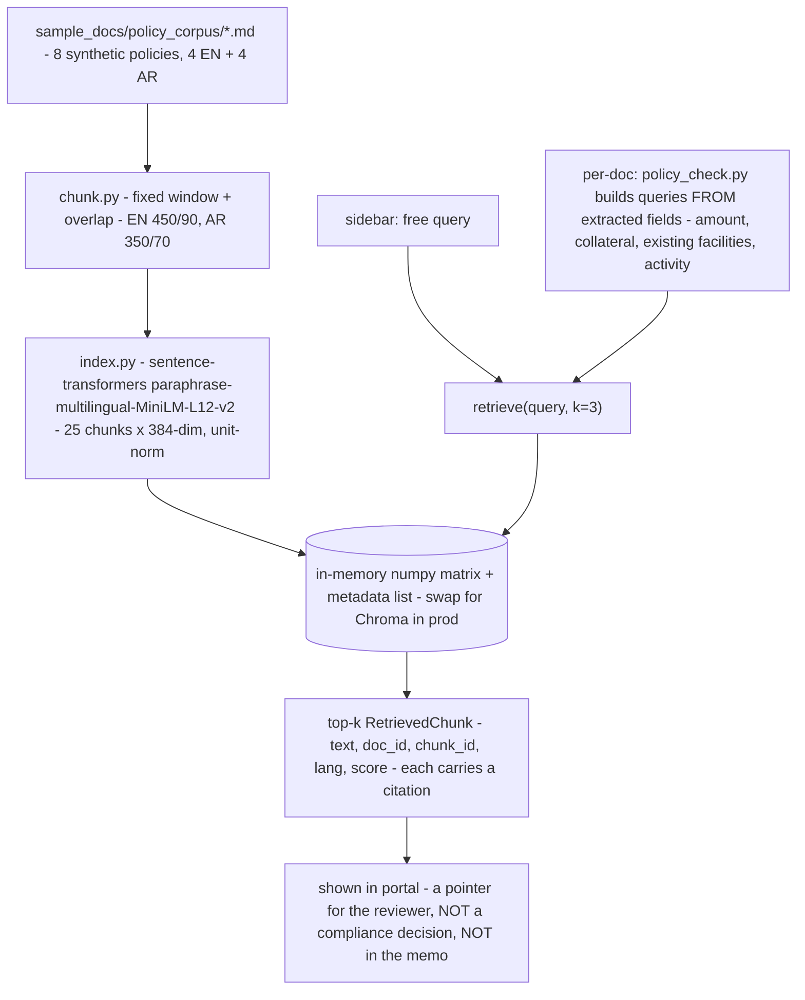

# How the app works — flow

Companion to `SPEC.md` (what each capability must do) and `PLAN.md` (schedule). This file is the
runtime picture: what runs when, and where each module sits.

---

## 1. Top level

The two RAG boxes are **dashed** on purpose: they never touch a field or the memo (SPEC §9 —
isolated demo). Everything solid is the credit-memo pipeline.

---

## 2. The pipeline — `ingest → extract → validate`

LangGraph runs three nodes in order. Any node can write `error` to state and the rest is skipped.

Key rules:
- **`quality_ok = False`** (unreadable / degraded doc) → Financial Wizard returns nothing. The
  pipeline refuses to guess (SPEC §8.2).
- **Citation Validator is deterministic** — no LLM. A correct value whose snippet is not
  verbatim on the page still gets flagged `needs_review`. That is the safety net, not a bug.
- **The memo uses `confirmed` fields only.** A `needs_review` field is excluded until a human
  ticks *Confirm*.

---

## 3. MLX model management (when `POC_LLM_PROVIDER=mlx`)

The Mini (24 GB) holds **one** model at a time. `src/mlx_servers.py` swaps them.

- Every swap first **reaps orphan `mlx_lm` / `mlx_vlm` servers** and waits for freed memory.
- On a dropped connection mid-generation (OOM), `_complete_json_mlx` restarts the server once
  and retries, then gives a plain "out of memory — close other apps" message.

---

## 4. RAG — isolated policy lookup (SPEC §9)

Not a pipeline node. Built once per process (lazy), then instant.

Gold check: `evaluation/run_rag_eval.py` — 13 questions (7 EN, 6 AR) → **13/13 land on the
right passage**. Not the proposal §9.3 KPI (corpus is deliberately tiny).

---

## 5. Module map

| Path | Role |
|------|------|
| `src/review/app.py` | Streamlit portal — queue, live pipeline log, review UI, report button, RAG panels |
| `src/orchestration/graph.py` | LangGraph wiring: `ingest → extract → validate`, `run_extraction()` |
| `src/agents/document_ingestor.py` | PDF text + OCR branch (tesseract / vision / mlx_vision / fused), classify, quality gate |
| `src/agents/vision_extractor.py` | Fused VL engine — one call per scanned page: transcribe **and** extract fields |
| `src/agents/financial_wizard.py` | Field extraction — per-field / batch, narrative-field prompts, prefetched-field path |
| `src/agents/citation_validator.py` | Deterministic: is each snippet verbatim on its cited page? |
| `src/agents/narrative_synthesizer.py` | Draft memo from **confirmed** fields + citation guardrail |
| `src/llm_client.py` | One `complete_json()` over three providers (mlx / ollama / api) + JSON repair |
| `src/mlx_servers.py` | Start/stop/reap mlx servers, one model resident at a time |
| `src/rag/` | `chunk` · `corpus` · `index` · `retrieve` · `policy_check` — isolated |
| `reports/live_report.py` | PDF report (single + batch) |
| `evaluation/` | `run_full_sweep.py` (field status), `run_rag_eval.py` (retrieval), `EXPECTED_RESULTS.md` (answer key) |
